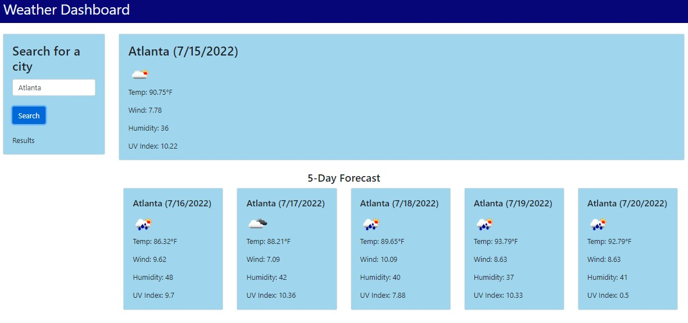

# Julian-Franklin-Weather-App

## Description

The Weather App is designed to allow users to search and view the current weather and 5-day forecast of a city. Users will see a search box title "Search for a City" where they will be able to enter a city to view the weather. This information is saved in local storage and pushed to the card for users to view their recent searches. Users will be able to see the current day weather in the large, main weather card, and the 5 day forecast in cards below. This app is designed for users in need of current and future weather information! This website uses HTML, CSS, Bootstrap, JavaScript, and Open Weather Source API. ~Created by Julian Franklin~

## Link to Website

[Julian Franklin's Weather App](https://jfranklin12.github.io/Julian-Franklin-Weather-App/)

## Deployed Application Screenshot

